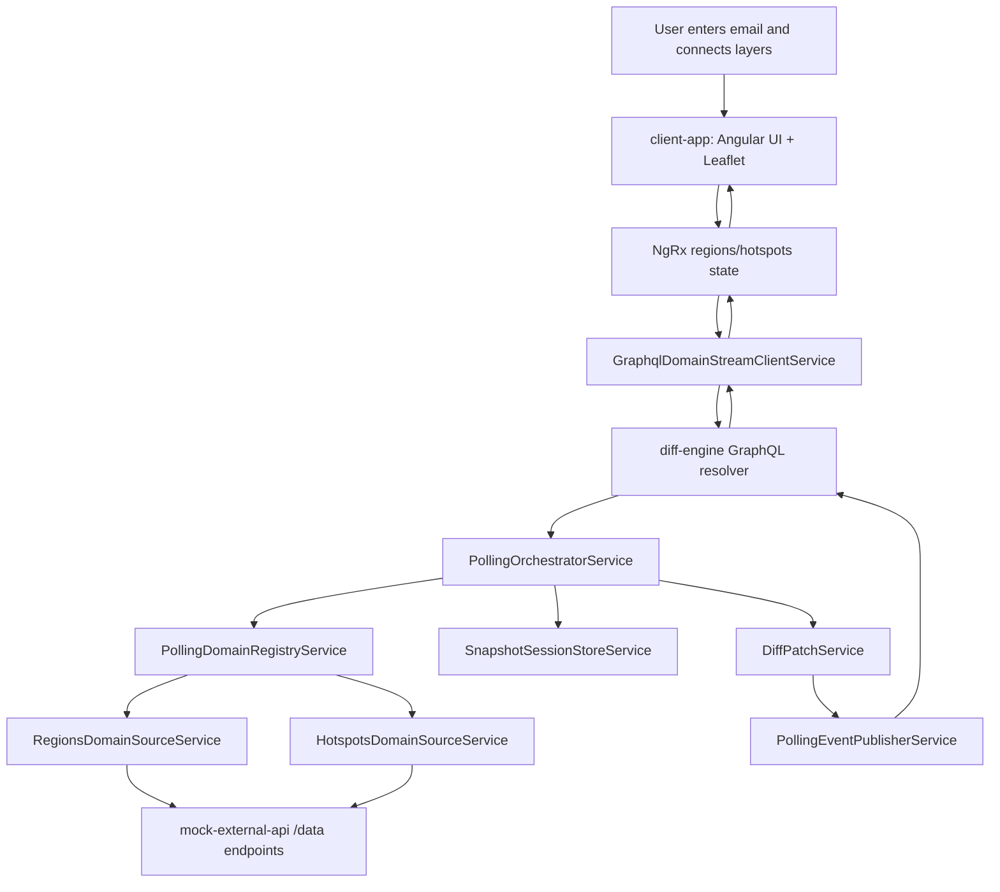

# Parli Geo Streaming Lab

Parli Geo Streaming Lab is a demo application for realtime geospatial layer updates. An Angular client subscribes to a NestJS diff engine, which polls a mock external API, computes JSON patch diffs, and updates a Leaflet map with regions and hotspots.

## Summary PDF

A one-page repo summary is available at [output/pdf/parli-app-summary-one-page.pdf](output/pdf/parli-app-summary-one-page.pdf).

## What This Repo Contains

- `client-app`: Angular standalone frontend with NgRx-managed realtime layer state and a Leaflet map.
- `diff-engine`: NestJS GraphQL service that starts polling sessions, stores snapshots, computes diffs, and publishes events.
- `mock-external-api`: NestJS HTTP service that returns seeded, mutable demo data for `regions` and `hotspots`.
- `models`: Shared library for domain types, polling envelopes, and map geometry models.

## Key Features

- Displays polygon regions and circle-based hotspots on a single map canvas.
- Maintains separate NgRx actions, reducers, and effects for each realtime layer.
- Starts per-domain sessions through GraphQL mutations and listens for updates over GraphQL WebSocket subscriptions.
- Sends full snapshots first, then JSON patch operations for subsequent updates.
- Polls `regions` every 2000 ms and `hotspots` every 1500 ms by default.
- Seeds mock data by email, so the same user gets stable but evolving demo sessions.
- Shows connection status, patch activity, visible feature counts, and latest update timing in the UI.

## Architecture

### Runtime components

- `apps/client-app`
  - `AppComponent` coordinates the dashboard, email input, layer connect and disconnect actions, and map rendering.
  - `GraphqlDomainStreamClientService` talks to the diff engine over HTTP and `graphql-ws`.
  - NgRx reducers apply snapshots and patches into explicit `regions` and `hotspots` state slices.
  - `MapCanvasComponent` renders the current layer snapshots with Leaflet.
- `apps/diff-engine`
  - `PollingGraphqlResolver` exposes `startPolling`, `stopPolling`, and `pollingEvents`.
  - `PollingOrchestratorService` starts polling sessions, fetches data, computes patches, and emits events.
  - `SnapshotSessionStoreService` stores session snapshots using an in-memory adapter.
  - `DiffPatchService` uses `fast-json-patch` to compare snapshots.
  - `PollingEventPublisherService` publishes per-stream events via `PubSub`.
- `apps/mock-external-api`
  - Exposes `GET /data/:domain?email=...` for `regions` and `hotspots`.
  - Generates and mutates seeded demo data per email.
- `libs/shared/models`
  - Contains shared polling contracts, domain guards, feature models, and map geometry types.

### Repo-evidenced data flow



## How To Run

### Minimal startup

1. Install dependencies:

```bash
npm install
```

2. Start all three services:

```bash
npm run start:all
```

This script runs:

- `npm exec -- nx run mock-external-api:serve`
- `npm exec -- nx run diff-engine:serve`
- `npm exec -- nx run client-app:serve`

### Fallback if `start:all` does not work in your shell

The current `start:all` script uses `sh -c`. If your environment does not provide `sh`, run these in separate terminals:

```bash
npm exec nx run mock-external-api:serve
npm exec nx run diff-engine:serve
npm exec nx run client-app:serve
```

### Verified ports from source

- Mock external API: `http://localhost:3334`
- Diff engine GraphQL HTTP: `http://localhost:3335/graphql`
- Diff engine GraphQL WebSocket: `ws://localhost:3335/graphql`
- Client dev URL: Not found in repo

### Using the app

1. Open the client URL printed by `client-app:serve`.
2. Leave the default email as `demo@example.com` or enter another email.
3. Connect the `regions` and `hotspots` layers.
4. Watch the map, patch logs, and dashboard stats update in realtime.

## Useful Nx Commands

```bash
# Explore projects
npm exec nx show projects

# Inspect a project
npm exec nx show project client-app --json
npm exec nx show project diff-engine --json
npm exec nx show project mock-external-api --json

# Build
npm exec nx run client-app:build
npm exec nx run diff-engine:build
npm exec nx run mock-external-api:build

# Test
npm exec nx run client-app:test
npm exec nx run mock-external-api:test
npm exec nx run models:test

# Lint
npm exec nx run client-app:lint
npm exec nx run diff-engine:lint
npm exec nx run mock-external-api:lint
npm exec nx run models:lint
```

## Notes

- The old README content in this repo was the default Nx starter template and did not match the current projects.
- The current README is based on code in `apps/client-app`, `apps/diff-engine`, `apps/mock-external-api`, `libs/shared/models`, plus `package.json` and Nx project configuration.
- Items marked as "Not found in repo" were intentionally not guessed.
